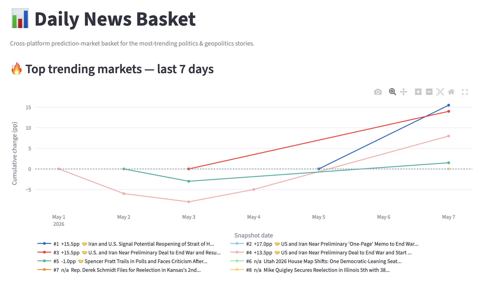
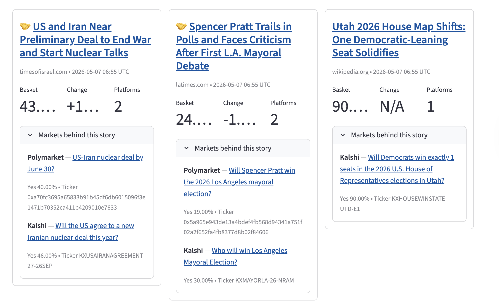
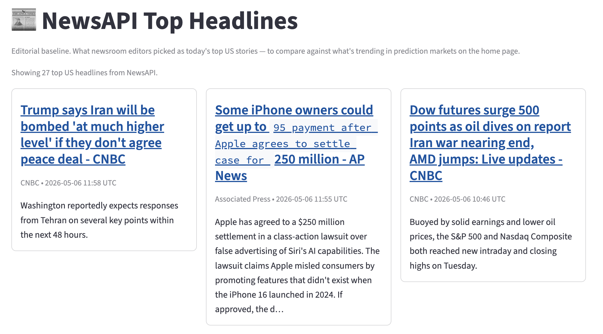

# Daily News Basket — A Cross-Platform Prediction-Market Tracker

*Final project for Advanced Computing, SIPA -- Spring 2026. Built with my teammate Naveen.*

## What it is

We built a dashboard that is meant to tell you which political and geopolitical stories the prediction markets are moving on, right now. In other words, which market on those topics have been the most volatile. Instead of looking at Polymarket or Kalshi in isolation, the app pulls from both, finds the markets that are actually about the same underlying event, and averages them into one cross-platform "basket" probability. Then it ranks every story by how much that basket moved in the last 24 hours and shows you the news article that talks about the same underlying story.

The point is that any one prediction market is noisy — different user bases, different liquidity, different ways of phrasing the same question — but if Polymarket and Kalshi are both saying the same thing, that's a much stronger signal than either one alone. And if they suddenly disagree, that's interesting too.

## Why we ended up rebuilding it

Our first version did the obvious thing: pull the day's top headlines from NewsAPI and try to find a matching prediction market for each one. We got it working, and then we realized it was the wrong way around. We were replicating the very bias we were trying to go around. Plus, Most of the day's biggest news stories don't have a market attached to them, so we were throwing away most of the headlines and getting weak matches on the rest.

So we flipped it. A market that has moved is, by definition, attached to a story — otherwise nobody would be trading on it. So we start from the markets, take the ones that moved the most in the last 24 hours, and only then go look for the news.

## How it actually works

Every night a GitHub Action wakes up and runs the pipeline. It hits the Polymarket and Kalshi APIs directly (no key needed for either), pages through their open markets, filters down to politics and geopolitics, and keeps the top ~50 movers on each side with a $1k volume floor so we're not chasing thin, jumpy markets.

Then comes the most time-consuming part. We send both lists to Gemini and ask it to pair up markets that are measuring the same outcome. This is where it got harder than we initially thought — the first version of the prompt cheerfully paired "next U.S. president" with "GOP nominee," or "S&P above 6000 by year-end" with "S&P above 6500 by mid-year." So the prompt now passes in the close times explicitly and is very strict about rejecting pairs that disagree on timeframe, threshold, direction, or scope. After pairing, we make a second Gemini call with Google Search grounding to find the actual news article from the last week that relates on the precise topic and perhaps is even one the enabler of the market move. The grounded search piece is what lets us put a real headline next to each market without maintaining our own news index.

Everything lands in three BigQuery tables — daily headlines, market matches, and story baskets — and the Streamlit app reads from BigQuery only. No live API calls at page load, so the dashboard stays fast even if Polymarket or Kalshi is having a bad day.

The homepage has a 7-day chart at the top showing the trending stories rebased to zero, so a 92→95 swing and a 50→53 swing look the same size on the y-axis (otherwise the high-priced markets visually dominate even when they barely moved). Below that is a card grid of the top 15 movers, each with the basket price, the 1-day change in percentage points, and the news article that goes with it. Stories that exist on both platforms get a 🤝 badge; the others are still shown but flagged as single-platform.

We also wanted to eliminate bias in movement coming from the thinness of a market, meaning that we log the volume so we avoid a thin market that had a big capital injection appearing in our top trending markets, as it could potentially be due to a single person and not reflect a general interest in it.

## What I worked on

I built part of the data side for the final version: the BigQuery schema, the cached read layer the app uses, and the scheduled GitHub Action, the app deployment, the ruff cleaning. But in the earlier version I also worked on: the original Streamlit + Polymarket + Kalshi integration (streamlit code, polymarket, kalshi), the cross-platform averaging function and its tests (Avg_func.py), the BigQuery migration (shift all dataset to bigquery), and the first-pass keyword/Attena-based matching that ended up motivating the rebuild.

## What I'd do next

The Gemini pairing step is the slowest and most expensive part of the
pipeline, and also the most unreliable. But the pairings themselves — which
Polymarket market corresponds to which Kalshi market — don't actually change
much from one day to the next, even though the prices do. Caching them and
only re-validating when a new market enters the top 50 would cut the cost a
lot. I'd also lean harder into the comparison between what the news is
covering and what the markets are pricing — those two things often disagree,
and I think the disagreement is the most interesting thing the dashboard
could be showing.

## Stack

Python, Streamlit, Plotly, Google BigQuery, Google Gemini (with Search grounding), the Polymarket Gamma API, the Kalshi v2 API, GitHub Actions for the nightly ETL, pytest and ruff in CI.

## Links

- **Repo:** https://github.com/advanced-computing/wiggly-donut
- **Live app:** https://prediction-news.streamlit.app/

## Screenshots

*Top panel of the homepage: 7-day cumulative pp-change for the top trending stories, rebased to zero so swings on a 90¢ market and a 30¢ market are visually comparable.*

*Card grid of the day's top movers. Each card shows the basket price, 1-day change in pp, and platform count, and expands to reveal the underlying Polymarket and Kalshi markets behind the story.*

*Companion page comparing what newsroom editors are leading with against what the prediction markets are moving on — the gap between these two views is, to me, the most interesting thing the dashboard surfaces.*
